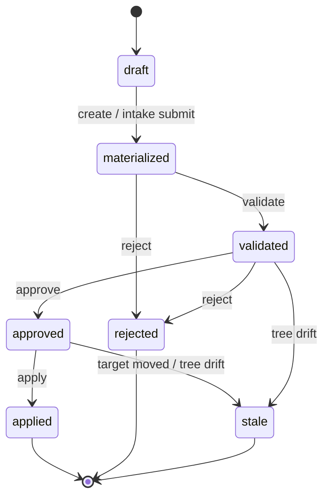

# Architecture

Current system architecture for self-nomad `1.0.0` (schema version 1).

## Layers

```text
CLI (Typer)  /  MCP server (optional)  /  Python SelfNomad API
        │                 │                      │
        └──────────── Application services ──────┘
                         │
     ┌───────────────────┼───────────────────┐
     │                   │                   │
 Repository          Proposals            Intake
 validation          lifecycle            receipts
     │                   │                   │
     └────────── Domain models & policy ─────┘
                         │
              Filesystem + Git backend
```

- **CLI** translates terminal I/O and stable JSON envelopes.
- **MCP** exposes a closed seven-tool surface over stdio only ([mcp.md](mcp.md)).
- **Application** (`SelfNomad`) orchestrates use cases.
- **Adapters** return transfer plans; they never run Git or approve proposals.
- **Policy** constrains sizes and paths; it does not perform runtime writes.
- **Git** runs with hooks disabled, prompting disabled, and timeouts.

## Package map

| Package | Role |
| --- | --- |
| `self_nomad.cli` | Typer commands |
| `self_nomad.application` | `SelfNomad` facade |
| `self_nomad.repository` | Layout, validation digests |
| `self_nomad.proposals` | Isolated proposal service |
| `self_nomad.intake` | ProposalRequest load/preview/submit |
| `self_nomad.adapters` | Hermes / OpenClaw plus `kit` / `example` |
| `self_nomad.snapshot` | History-free pack / check / install |
| `self_nomad.mcp_server` | Optional MCP (depends on `mcp` extra) |
| `self_nomad.git` | Managed Git invocations |
| `self_nomad.filesystem` | Atomic writes, hashing, path rules |

Dependency direction: outer interfaces → application → domain/services →
filesystem/Git. Adapters depend on repository/domain only.

## Proposal lifecycle



Apply uses `git update-ref <ref> <new> <expected-old>`. A clean checked-out
target is then `reset --hard` to the new commit. A dirty worktree is refused
([ADR 0008](decisions/0008-apply-checked-out-worktree.md)).

## Intake and receipts

Intake freezes `request_id` digests, target branch, and base commit in durable
receipts under private platform state. Preview is zero-write. Submit may
recover interrupted materialization without allocating a second proposal ID.
See [agent-intake.md](agent-intake.md).

## Restore transaction


## Private platform state

Proposal records, worktrees, intake receipts, and restore backups live under
the platform state directory (XDG / platformdirs), keyed by a hash of the
repository path (`r/<key>/…`). Compact path segments keep Windows path limits
in check. **This state is not portable content.**

## MCP boundary

Optional process `self-nomad-mcp --repo /abs/path` binds one repository for the
process lifetime. Seven native tools; no approve/apply/import/restore. Protocol
on stdout; diagnostics on stderr. Host filters complement the server allow-list.

## Related ADRs

- [0001 Git CLI](decisions/0001-git-cli.md)
- [0002 YAML](decisions/0002-yaml.md)
- [0003 Repository format](decisions/0003-repository-format.md)
- [0004 Local state](decisions/0004-local-state.md)
- [0005 Agent intake](decisions/0005-agent-intake.md)
- [0006 Bounded MCP surface](decisions/0006-bounded-mcp-surface.md)
- [0007 Publishable package profile](decisions/0007-publishable-package-profile.md)
- [0008 Apply on a clean checked-out target](decisions/0008-apply-checked-out-worktree.md)
- [Compatibility](compatibility.md)
